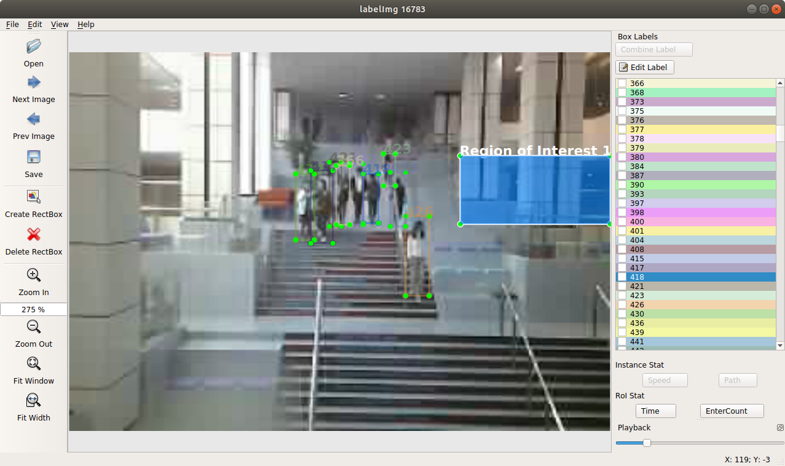
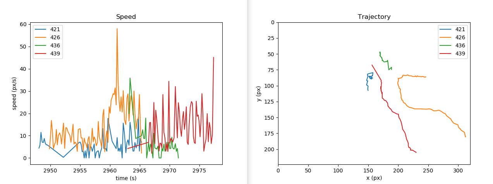
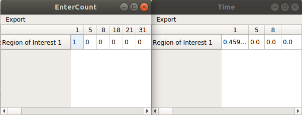

# TrackingAnalyze

Tool for animal tracking and analysis.

## Demo

### Video Playback and Tracking



#### Manual correction

- [x] Combine two trackers
- [ ] Split tracker

### Instance analysis

Plot:

- [x] Speed
- [x] Trajectory



### Region of Interest analysis

Export to table:

- [x] Count how many times each instance enters each region of interest.
- [x] Total time each instance spent inside each region of interest.



## Build

```bash
conda install pyqt=5
pyrcc5 -o libs/resources.py resources.qrc
python labelImg.py
```

## Credit

- [labelimg](https://github.com/tzutalin/labelImg)
